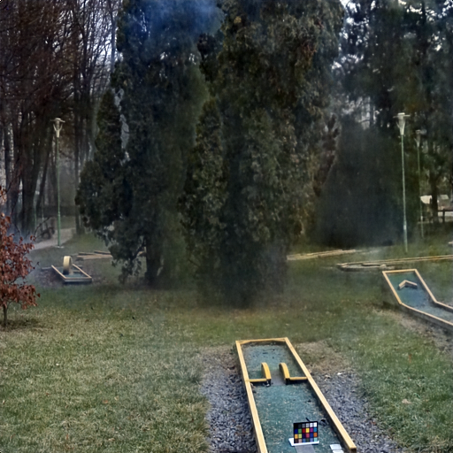

# FSDGN-Simplified-version
Because the official version has too many documents, so I simplify it, if you find some errors, you can propose it in Issue section.Thank you.

The from of image is XXX_1.jpg.
You can modify the path of trainset in the train.py, and then run it.
The follow is official link
https://github.com/yuhuUSTC/FSDGN

This paper can reappear absolutely, Here is the result of my run in NH dataset,
| Tables   |      PSNR      |  SSIM |
|----------|:-------------:|------:|
| NH |  19.57 | 0.759 |

considering the difference of training dataset and testing dataset, the difference between it and paper, it's acceptable, excellent job.

